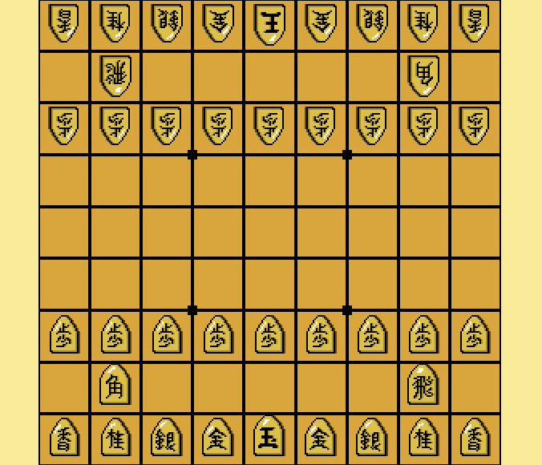

# Pixel shogi
This is a desktop game written in C++ with SDL2 featuring hand drawn
pixel graphics.

Shogi is a Japanese game resembling Chess, with the unique feature
that pieces captured from the opponent can reused. Any time it's your
turn you may choose, instead of moving a piece, to place a piece
you've captured from the opponent on the board.

## Status
The core of the game is playable, but menus and victory detection are
yet to be implemented.

## Installation
- Make sure you have Make, CMake and SDL2 installed
- Clone the repo using `git clone https://github.com/andersthune/pixel-shogi.git`
- Enter the repo, and compile by running `cmake` and `make`
- Run the executable with `./shogi`

## Screenshots

